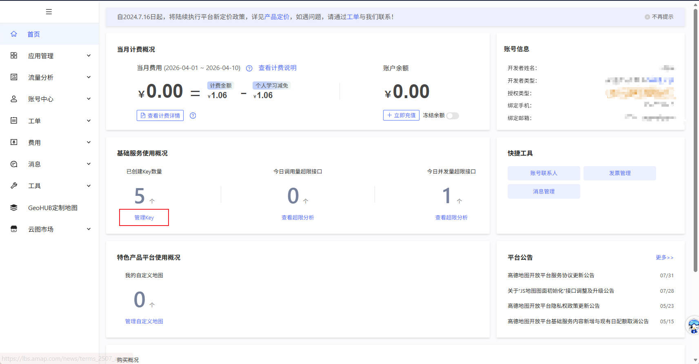
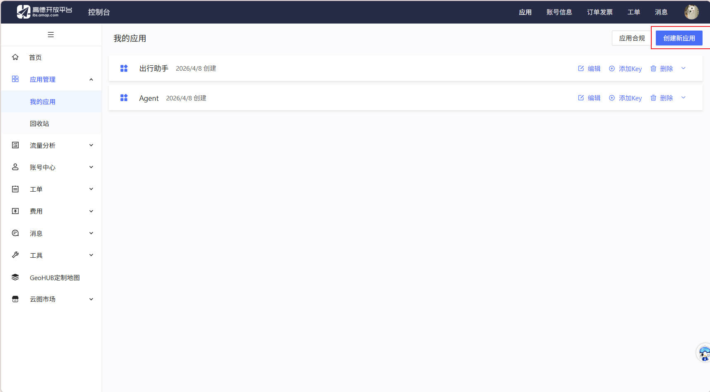
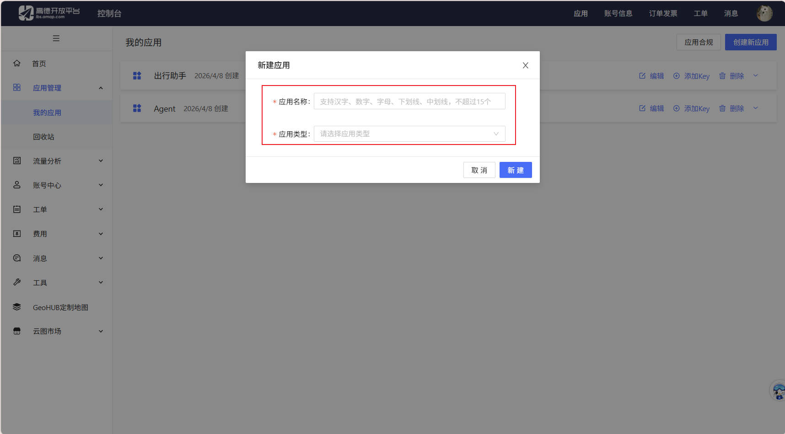
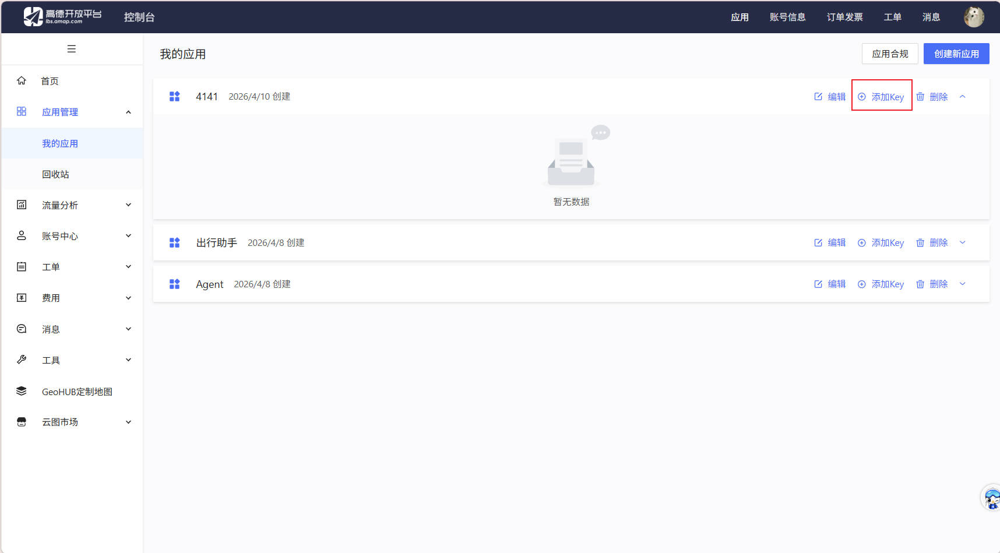
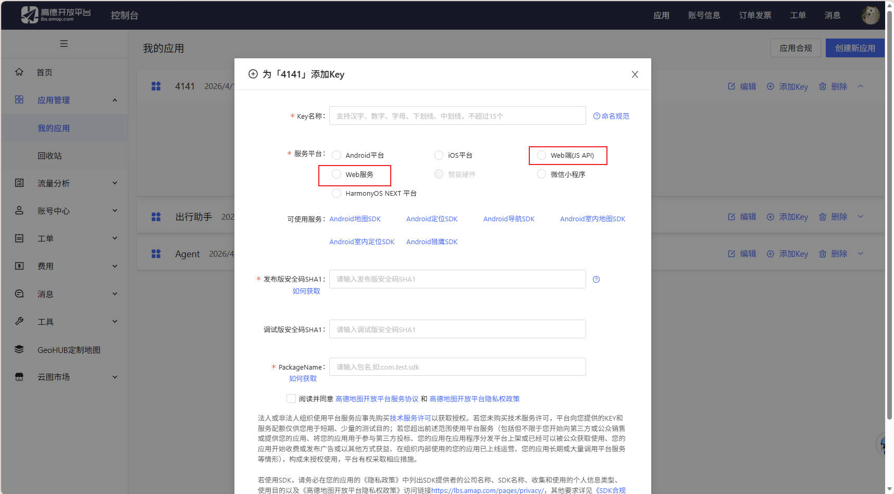
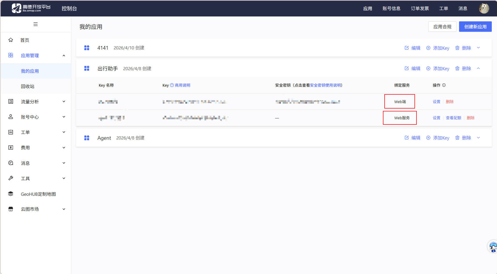
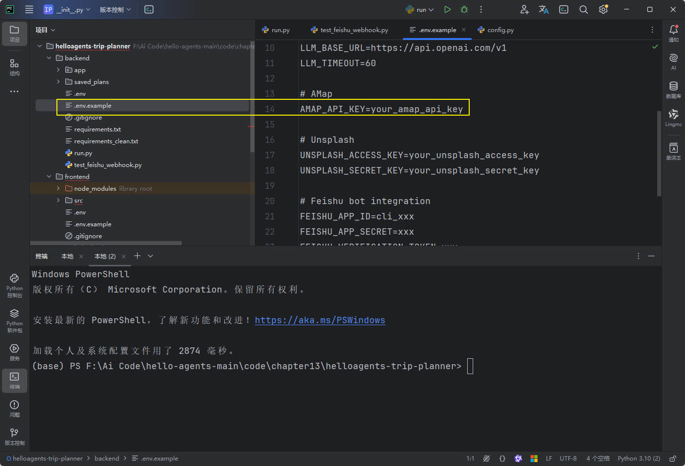

# 高德API Key申请流程和操作过程

[高德开放平台 | 高德地图API](https://lbs.amap.com/)

## 1.进入控制台

## 2.点击创建应用

应用名称随便输入，类型选**出行**

点击添加Key,**注意：**这里我们要申请两个key(**一个web服务，一个web端**)

申请界面，**一定要申请两个**

申请完应该是下面**两个不同的key**

## 3.进入文件配置地方

同理前端的.env.example将刚才两个key填入
